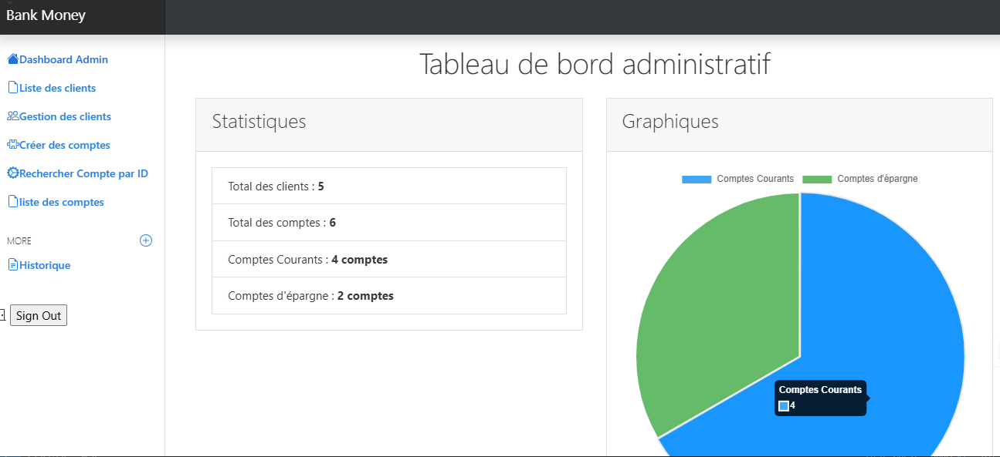
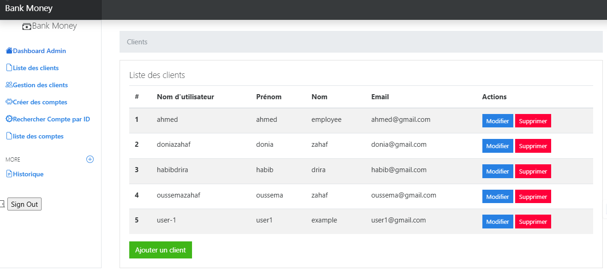

# Miniprojet - Banque Django
 
## Prérequis
Avant de commencer, assurez-vous d'avoir installé les outils et technologies suivants :
- **Python** (version 3.8 ou supérieure)
- **PostgreSQL**
- **Visual Studio Code** (ou tout autre éditeur de code)
- **Django** (compatible avec le projet)
- Un **environnement virtuel Python**
 
## Étapes d'installation et de configuration
 
1. **Ouvrir le projet dans Visual Studio Code**  
   - Lancez **Visual Studio Code**.  
   - Naviguez jusqu'au dossier contenant le projet Django.  
   - Ouvrez le terminal intégré via **Terminal > New Terminal**.
 
2. **Activer l'environnement virtuel**  
   - Dans le terminal, exécutez les commandes suivantes pour activer l'environnement virtuel :  
     ```bash
     cd C:\...\django-projet\my_env
     .\Scripts\Activate
     cd C:\...\django-projet\banque
     ```
 
3. **Configurer la base de données**  
   - Ouvrez le fichier **`settings.py`** situé dans le dossier principal du projet.  
   - Configurez la base de données PostgreSQL avec les paramètres suivants :  
     ```python
     DATABASES = {
         'default': {
             'ENGINE': 'django.db.backends.postgresql',
             'NAME': '<nom_de_la_base>',
             'USER': '<nom_utilisateur>',
             'PASSWORD': '<mot_de_passe>',
             'HOST': '<adresse_hôte>',
             'PORT': '<port>',
         }
     }
     ```
 
4. **Appliquer les migrations**  
   - Dans le terminal, exécutez les commandes suivantes pour générer et appliquer les migrations :  
     ```bash
     python manage.py makemigrations
     python manage.py migrate
     ```
 
5. **Lancer le serveur Django**  
   - Démarrez le serveur en exécutant :  
     ```bash
     python manage.py runserver
     ```
 
6. **Créer un superutilisateur**  
   - Créez un superutilisateur pour accéder à l'administration Django :  
     ```bash
     python manage.py createsuperuser
     ```
 
7. **Fonctionnalités principales**  
   - **Gestion des clients** : Ajout, modification, suppression et consultation des informations des clients.  
   - **Gestion des comptes** : Création, fermeture et consultation des comptes bancaires.  
   - **Gestion des transactions** : Retraits, versements, consultation des soldes et affichage de l'historique des transactions.

###  Des Captures pour l'application  :





